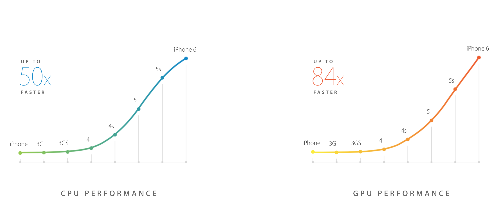
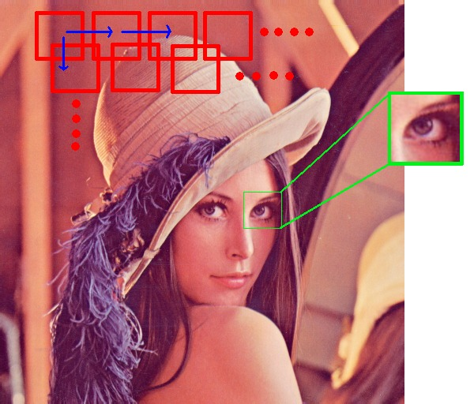
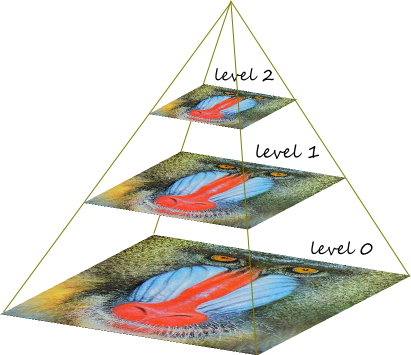
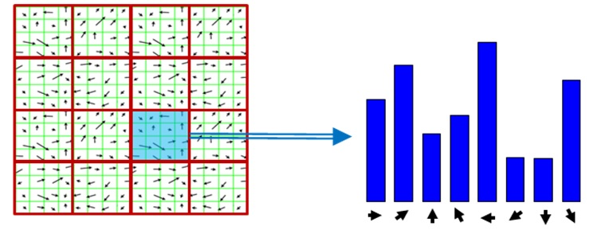
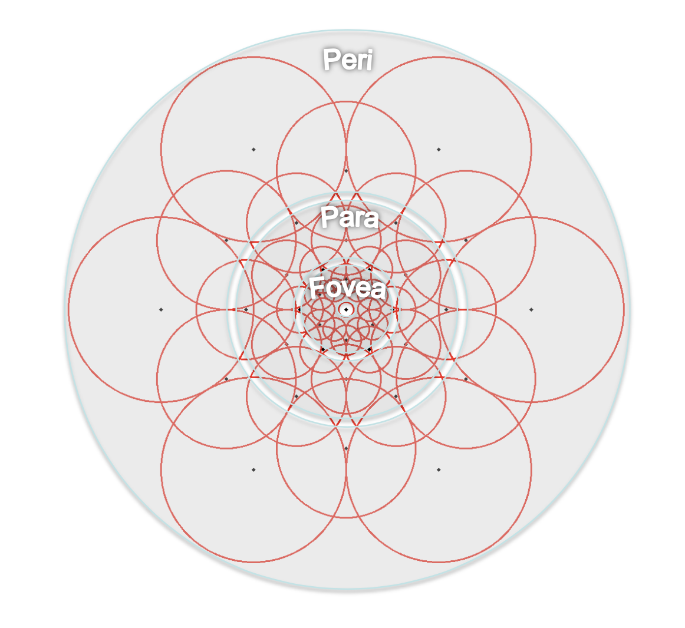
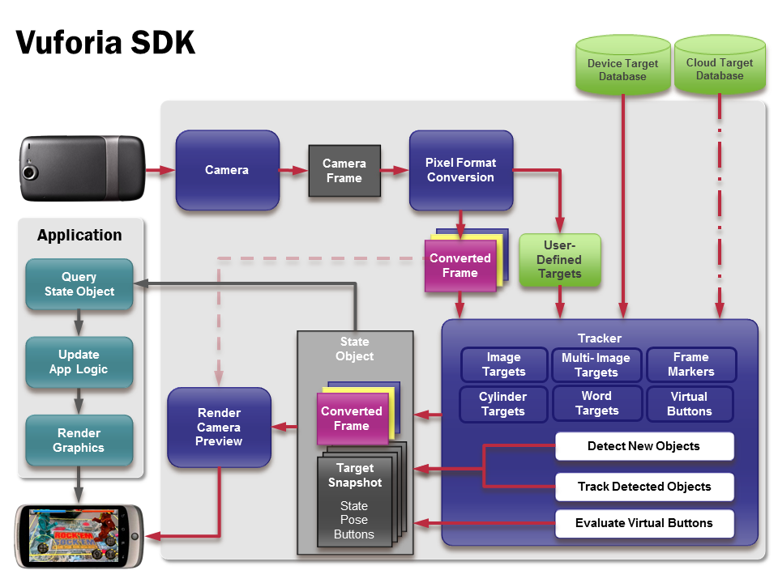
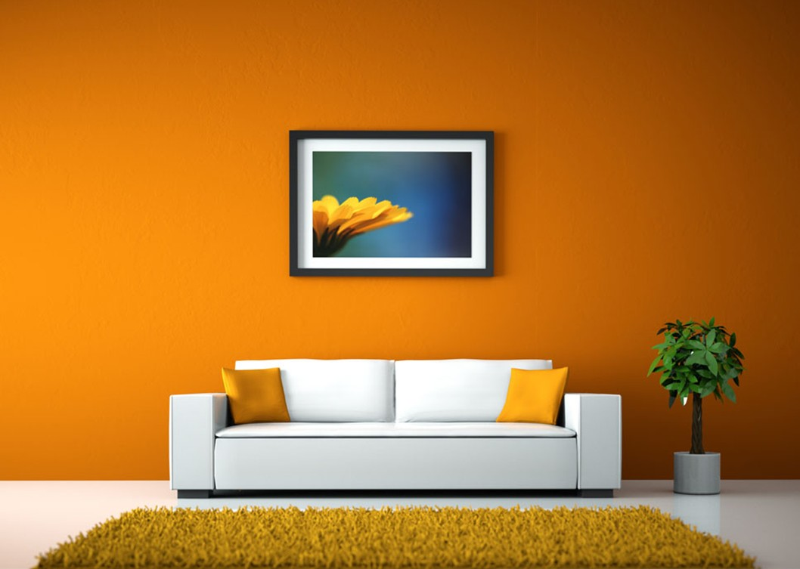

footer: Álvaro Medina Ballester, PFC EI, UIB, 2014

# Augmented reality on mobile devices
### A comparison of technologies to build augmented reality apps under iOS platform

---

### _Author_: Álvaro Medina Ballester

### _Professor_: Ramon Mas Sansó PhD.

^ Soy Álvaro Medina Ballester, estudiante de Ingeniería Informática en la UIB.

---

# [fit] What is augmented reality?

---

> Mix real world data with virtual elements.
-- Myself

^ Definición propia, pero buen resumen de lo que la teoría dice.

---

# [fit] Can be brought to mobile devices?

^ Pregunta retórica, vienen ejemplos y respuesta.

---

# [fit] Can be brought to mobile devices?

# [fit] Yes

---


^ Ejemplo de la aplicación de Lego con Vuforia. Podemos ver como se posicionan Legos virtuales sobre el catálogo de productos. Recalcamos la definición comentada previamente.

---


^ Skyguide, otro ejemplo con realidad aumentada usando únicamente la orientación y la localización del usuario.

---

# Augmented reality on mobile devices

- Different ways to bring it to mobile

^ Como hemos visto en la diapositiva anterior. Tanto temas de imágenes como de localización.

- Faster, more robust CV algorithms introduced recently

^ Ha sido la tendencia en los últimos años, a partir de la introducción de SIFT, todos lo han usado para comparar su rendimiento con éste.

- Powerful mobile devices

^ Luego en la gráfica lo explicamos con la plataforma iOS.

---

## AR on mobile

- Can use complex image processing

- Faster GPUs make possible to use real-time CV algorithms

- OpenGL ES

^ Con OpenCV, información de la cámara, etc. OpenGL for Embedded Systems, versión simplificada de OpenGL para dispositivos móviles.

- Can take advantage of another built-in sensors

^ Aparte de la cámara, podemos usar GPS, acelerómetro o giroscopio.

---

## A8 chip performance



- Source: Apple, Geekbench performance test

^ Es un benchmark clásico de procesador y gráfica.

^ Destacamos que en otras plataformas también se ha evolucionado mucho. Al fin y al cabo, es arquitectura ARM.

---

# Ponster
### Augmented reality app to draw posters on flat surfaces such as walls or doors

^ La aplicación que se ha desarrollado para hacer el estudio es una app de realidad aumentada para probar posters sobre superficies planas como una pared. Debe leer el input de la cámara y buscar un patrón sobre el cual pintar la imagen.

---


### Inspiration
# IKEA catalog

^ Un ejemplo de aplicación muy similar.

---


^ IKEA necesita el catálogo, Ponster le va bien cualquier imágen.

---

# Different ways to bring AR

- Image processing-only
- Sensors
- Combination

^ Como se ha comentado antes, existen varias aproximaciones. En las diferentes tecnologías probadas se han testeado estas diferentes configuraciones.

---

## First hypothesis
### Image processing-only

---

## First hypothesis
### Use video feed from the camera to process each frame with computer-vision algorithms

---

# Key concepts

- **Robustness**: quality of the tracking algorithm when the scene changes and the object to track is hard to determine.
- **Invariance**: capacity of algorithms to be tolerant to rotation, scale and perspective changes.
- **Performance**:
    - 20 FPS minimum acceptable
    - 60 FPS goal, 30 FPS enough

^ Conceptos importantes para entender el tracking y reconocimiento de imágenes.

^ La robusteza define la capacidad del algoritmo a soportar cambios en la escena.

^ Invarianza es la tolerancia a rotación, escala, etc.

^ 60 FPS es el objetivo, más de 20 es aceptable.

---

### Image processing-only approximation
## Template matching & feature detection

^ Dos aproximaciones: match template y detección de características.

---

## Template matching
### Find areas of an image that are similar to the _template image_ provided

^ Comparar las imágenes por áreas.

---

## Template matching



---


## Template matching

Several methods of template matching: `CCOR`, `SQDIFF`

^ Varios métodos para efectuar la comparación: correlación cúbica, square difference.


25~30 FPS on A6 chip

^ Buena performance.


Not invariant to rotation, scale, perspective warp

^ Malo para invariancia.


Easy to implement

^ Muy fácil de implementar

---

## Code example

```c++
// Perform Match Template
cv::matchTemplate(videoFrame, pattern, resultImage, matchMethod);

// If pattern has been found, draw poster
if (PatternDetector::isTracking()) {
  roiRect = cv::Rect(x, y, poster.size().width, poster.size().height);
  poster.copyTo(outputImage(roiRect));
}
```

^ Podemos ver cómo es un algoritmo muy básico de detección con Template matching.

---

# 👍

Fast to compute

Easy to develop


# 👎

Not rotation, scale and perspective invariant

Not very robust

^ Si cambia un poco la imagen, ya se deja de detectar.

---

# How to bring scale invariance to match template?

---

## Image pyramids



---

## Image pyramids


A basic image pyramid system has been developed for template matching.

Creating several source images at different sizes.

Easy to implement.

^ El sistema de pirámides implementado no era más que un test con 3 tamaños diferentes. Se probaba en cada pasada del algoritmo los 3 tamaños para encontrar el adecuado.

---

# Template matching
## Fast, easy to implement. More features needed (invariance).

^ Conclusiones: descartada.

---


# Feature detection

---


# Feature detection

- SIFT introduced in 1999 by David Lowe
- Many techniques available
- Three approximations tested: SURF, FREAK, ORB
- Most are invariant to scale, rotation and perspective

^ SIFT ha sido la primera en popularizarse. Se basan en tres fases (siguientes diapositivas)

---


---


# Feature detection
## Three steps

---

# [fit] Keypoint detection

^ 1: Detección de puntos de interés.

---

# [fit] Keypoint detection
## Corners, points, blobs, junctions

^ Detectar cualquier cosa como esquinas, uniones, etc.

---

# [fit] Keypoint detection
## Must be easy to find, repeatable, robust to image changes to get good results

^ La calidad del punto de interés es importante.

---

# [fit] Descriptors

^ 2: cálculo de descriptores.

---

# [fit] Descriptors
## Neighbourhood of keypoints

^ Buscamos áreas donde hay puntos de interés y generamos vectores.

---

# [fit] Matching

^ 3: correspondencia.

---

# [fit] Matching
## Between the feature vectors computed from both images

^ Comparamos los descriptores calculados.

---

# SURF
## Speeded-Up Robust Features

^ Primera aproximación testeada.

---

# SURF keypoint detector and descriptor extractor

^ Combinación de detector de puntos de interés y descriptor de SURF.

---

# SURF

- Combine both SURF keypoint detector and extractor

- Standard combination for all comparisons

- Slowest of all of the tested



---

# SURF

- Hessian matrix approximation for keypoints

- Descriptors based on histogram oriented gradients (HOG)[^1]

- Scale and rotational invariant


[^1]: Levi Gil, (2013, August 18). A Short introduction to descriptors [blog post], http://gilscvblog.wordpress.com/2013/08/18/a-short-introduction-to-descriptors/

---

# SURF

- Roughly 1 FPS on both iPhone 5 and iPhone 6

- Patented ©


---

# FREAK
## Fast Retina Keypoint

---

# FREAK
## SURF keypoint detector and FREAK descriptor extractor

^ Para FREAK hemos usado SURF para detectar puntos de interés

---

# FREAK

- SURF as keypoint detector

- FREAK as descriptor extractor becomes a huge performance improvement

- Uses a retina-like pattern for computing descriptors



---

# FREAK

- Generates binary descriptors

- Scale and rotation invariant


---

# ORB
## Oriented Fast & Rotated Brief

---

# ORB
## ORB feature detector and descriptor extractor

---

# ORB

- rBRIEF (Rotated BRIEF) for keypoint detection

- oFAST (Oriented FAST) for descriptor extractor

- Better performance than the other approximations

- Almost the same tracking quality

---

# Matching
## Different matching for the selected descriptors

---

# Matching
## Binary and not binary descriptors

---

# Brute force

Can be used in binary __Hamming distance__...

and non binary descriptors __L1/L2__


Has good performance with binary descriptors

^ Distancia de Hamming o Normal L1 L2.

---

# FLANN
## Fast library for approximate nearest neighbours

---

# FLANN

Many matching algorithms

Randomized-KD tree for SURF

Locality-Sensitive Hashing (LSH) for ORB

^ FLANN es un conjunto de algoritmos

^ Rand-KD usado para resolver el vecino más cercano.

^ LSH es una función de hash con una cierta amplitud que hace que los vectores similares colisionen en el mismo bucket.

---

# Performance comparison

---

# Average time for detecting keypoints


---

# FREAK vs SURF vs ORB descriptor performance


---

# FREAK vs SURF vs ORB number of good matches


---

# Feature detection

Not enough for AR apps on mobile devices

Heavy algorithms

Not so invariant to rotation, perspective

---

# [fit] Natural feature tracking

---

# [fit] Natural feature tracking
## Fast, robust and high-quality tracking on mobile devices

---

# Natural feature tracking

Detect interest regions

Compute the movement

Evaluate feedback

Not image processing-only technique

---

# Natural feature tracking

Thanks to mobile sensors, we can track the object even if all the interest points are not present in the scene.

Calculate the movement of the interest regions is faster than detecting features in each frame.

^ Aunque no tengamos sensores de movimiento, también podemos hacer natural feature tracking. Por ejemplo, con flujo óptico.

---

# Natural feature tracking
### The chosen technique for bringing AR to Ponster app (and many others)

---

# [fit] Technologies

---

## App built for iOS

---

## App built for iOS
### Objective-C, Objective-C++, C++

---

## App built for iOS
### UIKit, CoreData, CocoaPods

---

## App built for iOS
### AVFoundation, CoreVideo

---

## OpenCV SDK for AR

---

## OpenCV
### Version 2.4.8 and 2.4.9

---

## OpenCV
### Used to implement template matching & feature detection algorithms

---

## OpenCV
### Does not bring Natural Feature Tracking by default. It has to be implemented by developer. Not yet optimised for ARM architectures.

# 😕

^ Puede optimizarse con flags de compilación y haciéndolo a mano.

---

# The solution was to change to a mobile AR SDK that takes natural feature detection approach

---

# [fit] Vuforia

---


---

# Vuforia

High quality AR SDK

Based on natural feature detection

Uses mobile sensors to compute the pattern movement

Closed source, free to use

Optimised for ARM architecture

---

# Vuforia

Constant 30 FPS performance

Able to keep tracking even in the pattern is not entirely visible

Uses OpenGL ES for rendering

---



---

# Vuforia

- Developed by Qualcomm for ARM devices
- Uses FastCV
- Extended tracking
- Supports C++, Objective-C, Java and .NET
- Ready to integrate with Unity framework


---

# Vuforia

- Camera
- Converter
- Tracker
- Video Renderer
- Application Code

^ Camera: crea un frame propio
Converter: hace downscale de la imagen para performance
Tracker: computa CV con lo que más le conviene (inteligente)
Video Renderer: optimizado para multiplataforma
AppCode: buscamos patrones detectados en el tracker, actualizamos la app y enviamos a renderizar


---

# Performance comparison with OpenCV approximations


---

## Vuforia
### We have been able to efficiently detect the pattern and track it with maximum robustness, invariance and speed.
## ✌️

---

# 👍

Super fast

Mobile

Multiplatform

Free to use

Used by Lego and IKEA examples

---

# 👎

Propietary technology

Unknown tracking algorithm

Harder to integrate than OpenCV

Necessary to learn a bit of OpenGL ES

---

# [fit] Demo

---



---

# [fit] Questions?

---

### Many thanks to:

### Ramon Mas Sansó, Biel Moyà Alcover, Pau Rullan Ferragut, Gisela Ferreras, José Ruiz Bravo, Marc Tudurí Cladera, Xavier Leal Meseguer, Miguel Moyá, Domenec García and many others.

## 😊

---

# Source code
# [github.com/alvaromb/ponster](https://github.com/alvaromb/ponster)

---
