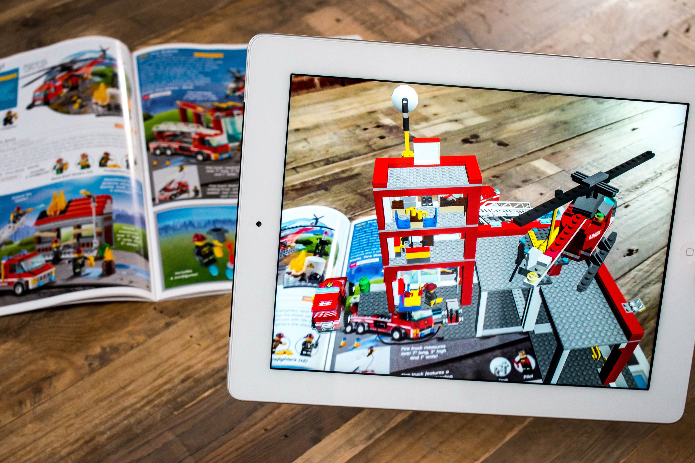
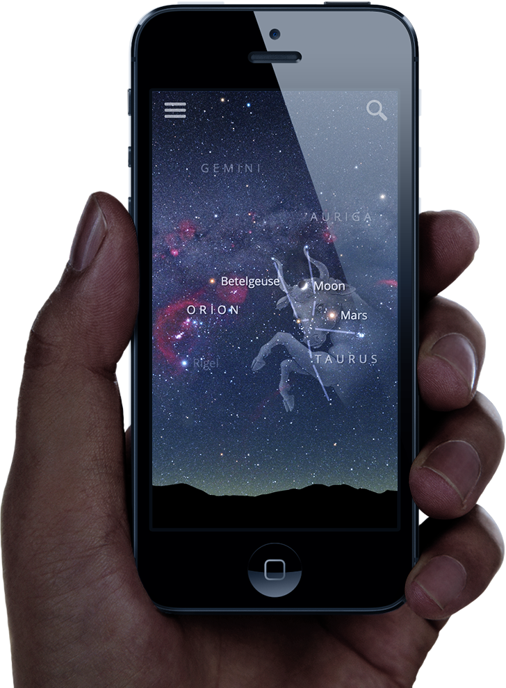

footer: Álvaro Medina Ballester, UIB, 2014

# Augmented reality on mobile devices
### A comparison of technologies to build augmented reality apps under iOS platform

---

# [fit] What is augmented reality?

---

> Mix real world data with virtual elements.
-- Myself

---

---

